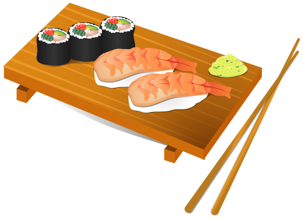
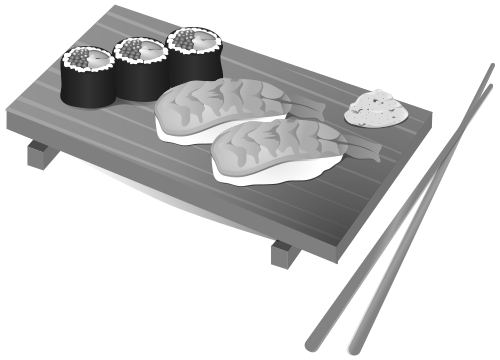
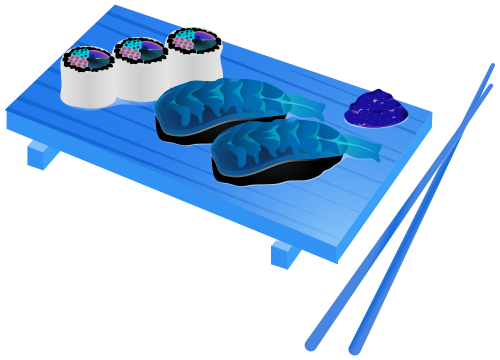
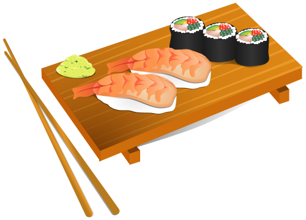
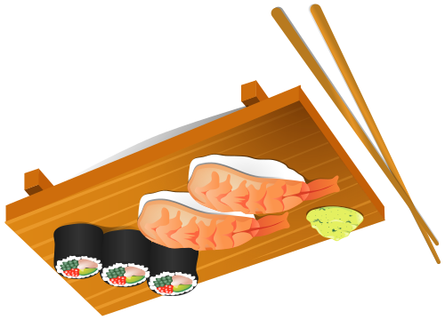

A few set of image filters, using compute shaders, because why not.

Taking this sushi image:

Currently, contains:

* Grayscale filter

* Color inversion filter

* Horizontal flip

* Vertical flip

* Basic box blur

* Gaussian blur

Test images:
* [Bled, Slovenia, from Ursa Bavcar](https://unsplash.com/photos/6O4zf9lga6Q)
* [Sushi](https://publicdomainvectors.org/en/free-clipart/Sushi-food-vector-illustration/13738.html)
